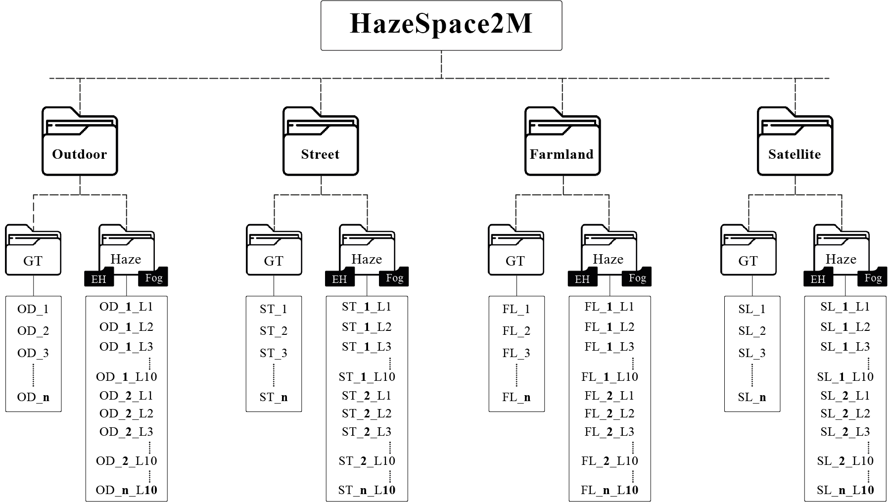

<h4 align="center"><strong><a href="https://2024.acmmm.org/">Published in ACM Multimedia 2024, Melbourne, Australia</a></strong></h4>
<h2 align="center"><strong>HazeSpace2M: A Dataset for Haze Aware Single Image Dehazing <a href="https://tanvirnwu.github.io/assets/papers/HazeSpace2M.pdf" target="_blank">[Paper]</a></strong></h2>
<h6 align="center">Md Tanvir Islam<sup> 1</sup>, Nasir Rahim<sup> 1</sup>, Saeed Anwar<sup> 2</sup>, Muhammad Saqib<sup> 3</sup>, Sambit Bakshi<sup> 4</sup>, Khan Muhammad<sup> 1, *</sup></h6>
<h6 align="center">| 1. Sungkyunkwan University, South Korea | 2. RUET, Bangladesh | 3. USTC, China | 4. Charles Darwin University, Australia | Australian Catholic University, Australia | Khulna University, Bangladesh || *Corresponding Author |</h6> 
<hr>


## HazeSpace2M Dataset


## Haze Aware Dehazing


## Dependencies
```
pip install -r requirements.txt
````

## Dataset Download
The subsets of the HazeSpace2M dataset are available for download.
1. [Outdoor (269GB)](https://huggingface.co/datasets/tanvirnwu/HazeSpace2M/tree/main/Outdoor) | 2. [Street (295GB)](https://huggingface.co/datasets/tanvirnwu/HazeSpace2M/tree/main/Street) | 3. [Farmland (90GB)](https://huggingface.co/datasets/tanvirnwu/HazeSpace2M/tree/main/Farmland) | 4. [Satellite (153GB)](https://huggingface.co/datasets/tanvirnwu/HazeSpace2M/tree/main/Satellite) 

## Pretrained Weights
All the pre-trained weights of the classifiers and the dehazers are available to download:
<br>
Google Drive: | [**Classifier**](https://drive.google.com/drive/folders/147o4ltcZUYyct8oaTED4KuJFkAiV66zC?usp=sharing) | [**Specialized Dehazers**](https://drive.google.com/drive/folders/110cLD5pfLqLuIV95yBBTvXhbIQ2aZ2kd?usp=sharing) |
## Testing
```
python inference.py --gt_folder <path_to_gt> --hazy_folder <path_to_hazy> --output_dir <output_dir> --classifier <path_to_classifier> --cloudSD <path_to_cloudSD> --ehSD <path_to_ehSD> --fogSD <path_to_fogSD>

````
_**Note:** Each variable is explained in the inference.py file._


## Use Own Classifiers
**To use your custom classifier, please follow the following steps:**
1. Write the code for your classifier architecture in the _**classifier.py**_ file in the _models_ folder.
2. Now define the object of your classifier in the _**classification_inference**_ method inside the _conditionalDehazing.py_ file under the _models_ folder.
3. Finally, define the weights of your classifier inside the _**inference.py**_ file
   
**To use your custom specialized dehazers, please follow the following steps:**
1. Write the code for your classifier architecture in the _**dehazer.py**_ file in the _models_ folder.
2. Now define the object of your dehazer in the _**load_model**_ method inside the _helper.py_ file under the _utils_ folder.
3. Finally, define the weights of your classifier inside the _**inference.py**_ file

## HazeSpace2M Folder Structure



## Cite this Paper

If you find our work useful in your research, please consider citing our paper:

```bibtex
@inproceedings{hazespace2m,
  title={HazeSpace2M: A Dataset for Haze Aware Single Image Dehazing},
  author={Islam, Md Tanvir and Rahim, Nasir and Anwar, Saeed and Saqib Muhammad and Bakshi, Sambit and Muhammad, Khan},
  booktitle={Proceedings of the 32nd ACM International Conference on Multimedia},
  year={2024},
  doi = {10.1145/3664647.3681382}
}
